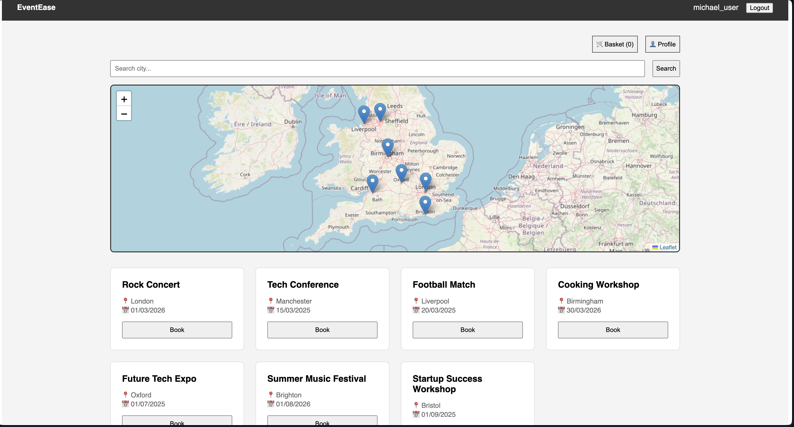

# EventEase 🎟️



EventEase is a modern, full-stack event management and ticket booking platform. It allows users to discover local events via an interactive map, manage a shopping basket, and track their bookings.

## Features
* **Interactive Map**: Discover events based on location using Leaflet.js.
* **Persistent Shopping Basket**: Add multiple tickets to a local basket and checkout all at once.
* **User Profiles**: View personal booking history and securely update account passwords.
* **Admin Dashboard**: System-wide oversight to monitor and manage all ticket sales.
* **Secure Authentication**: Session-based login system with role-based access.

## Technology Stack
* **Frontend**: React.js, React Router, Leaflet Maps.
* **Backend**: Node.js, Express.js.
* **Database**: SQLite3.
* **State Management**: LocalStorage for persistent basket data.

## Installation & Setup

1. **Clone the repository**
   ```bash
   git clone [https://github.com/yurihenrique98/EventEase_FullStack.git](https://github.com/yurihenrique98/EventEase_FullStack.git)
